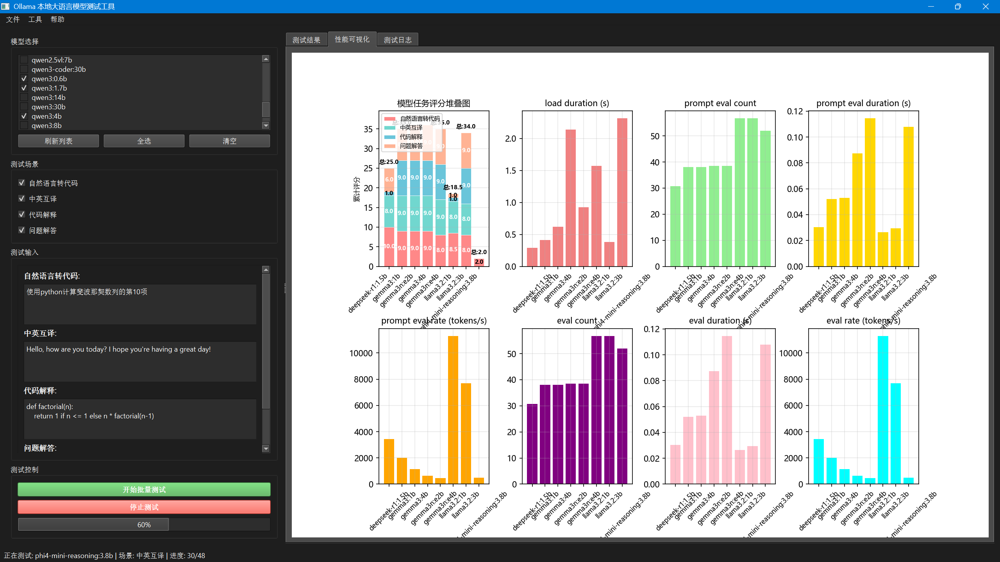

# OllamaModelTester

A comprehensive graphical interface tool for testing and comparing local Large Language Models (LLMs), built on Ollama, providing detailed performance metrics and visualization analysis.


## Features

- **Multi-Model Testing**: Test multiple Ollama models simultaneously
- **Performance Metrics**: Detailed analysis including tokens/second, response time, and resource usage
- **Visual Comparison**: Interactive charts and graphs for performance comparison
- **Test Scenarios**: Predefined test scenarios for different use cases
- **Real-time Monitoring**: Real-time progress tracking and detailed logging
- **Export Results**: Save test results in CSV format
- **Self-Assessment**: Models can evaluate the quality of their own responses

## System Requirements

- Python 3.8+
- Ollama installed and running
- Required Python packages (see installation instructions)

## Installation

1. **Install Ollama**
   ```bash
   # Visit https://ollama.ai/ for installation instructions
   ```

2. **Clone Repository**
   ```bash
   git clone https://github.com/EasyCam/OllamaModelTester.git
   cd OllamaModelTester
   pip install -r requirements.txt
   cd ollamamodeltester
   briefcase dev
   ```

## Usage

### 1. Model Selection
- Launch the application
- The tool will automatically detect available Ollama models
- Select models to test from the list
- Use "Select All" or "Clear" for batch operations

### 2. Test Configuration
- Choose from predefined test scenarios:
  - **Text Generation**: Creative writing and content generation
  - **Q&A System**: Factual question answering
  - **Code Generation**: Programming code creation
  - **Translation Tasks**: Language translation capabilities
  - **Text Summarization**: Text summarization abilities

### 3. Run Tests
- Click "Start Test" to begin evaluation
- Monitor real-time progress and detailed output
- View detailed performance metrics upon test completion





### 4. Results Analysis
- **Performance Metrics**:
  - Total duration
  - Load duration
  - Prompt evaluation rate (tokens/second)
  - Response generation rate (tokens/second)
  - Token counts (prompt, completion, total)
  - Time to first token (TTFT)

- **Visualization**:
  - Model performance comparison charts
  - Token rate analysis
  - Response time distribution
  - Self-assessment scores

### 5. Export Results
- Export test results in CSV format
- Includes all performance metrics and model outputs
- Suitable for further analysis or reporting

## Test Scenarios

The application includes multiple built-in test scenarios:

1. **Creative Writing**: Test model's ability to generate creative content
2. **Technical Q&A**: Evaluate factual knowledge and technical explanation capabilities
3. **Code Generation**: Assess programming abilities
4. **Language Translation**: Test multilingual capabilities
5. **Text Summarization**: Evaluate content compression skills

## Performance Metrics

The tool provides comprehensive performance analysis:

- **Speed Metrics**:
  - Prompt evaluation rate (tokens/second)
  - Response generation rate (tokens/second)
  - Total response time
  - Time to first token (TTFT)

- **Resource Metrics**:
  - Model loading time
  - Memory usage patterns
  - Token efficiency

- **Quality Metrics**:
  - Self-assessment scores (1-10)
  - Response completeness
  - Task-specific criteria

## Technical Details

- **Framework**: PySide6 (Qt for Python)
- **Backend**: Ollama CLI with verbose output parsing
- **Visualization**: Matplotlib with font support
- **Data Processing**: Pandas for result analysis
- **Threading**: Asynchronous testing to prevent UI blocking

## Troubleshooting

### Common Issues

1. **Ollama Not Detected**
   - Ensure Ollama is installed and running
   - Check if `ollama` command is available in PATH

2. **Model Loading Errors**
   - Verify models are properly installed: `ollama list`
   - Ensure sufficient system resources

3. **Performance Issues**
   - Close other resource-intensive applications
   - Consider testing fewer models simultaneously

4. **Display Issues**
   - Ensure proper font installation
   - Check system display scaling settings

## Contributing

Contributions are welcome! Please feel free to submit Pull Requests.

## License

This project is licensed under the GNU General Public License v3.0 - see the [LICENSE](LICENSE) file for details.


## Acknowledgments

- [Ollama](https://ollama.ai/) for providing local LLM infrastructure
- [PySide6](https://doc.qt.io/qtforpython/) for GUI framework
- [Matplotlib](https://matplotlib.org/) for visualization capabilities
