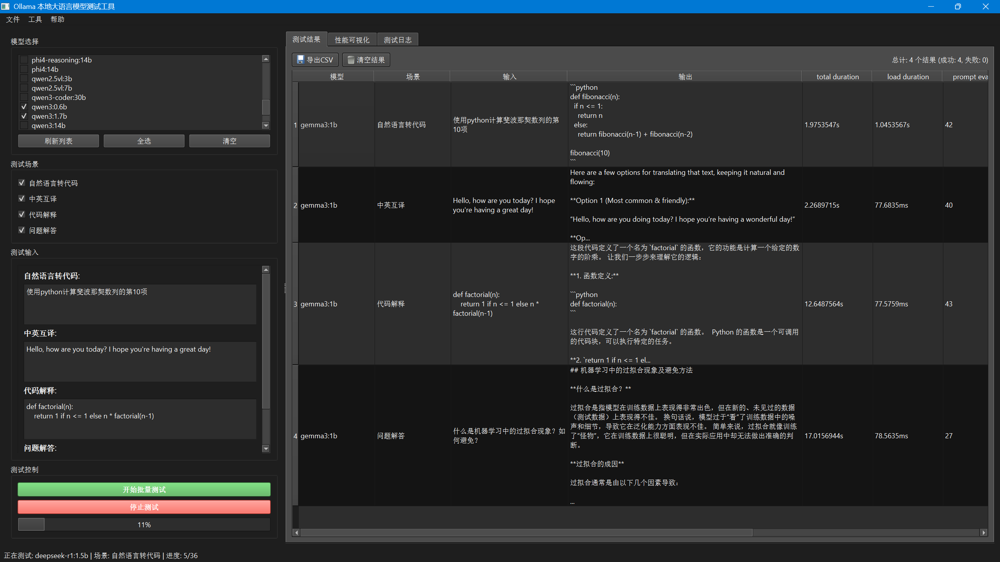
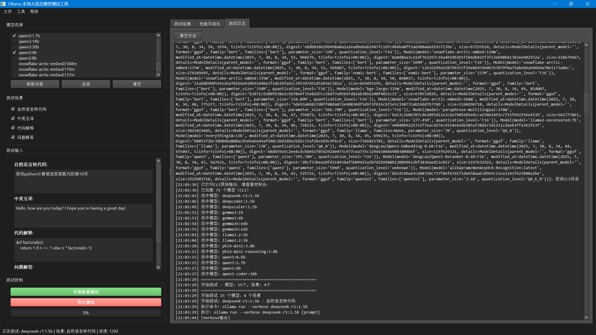

# OllamaModelTester

一个用于测试和比较本地大语言模型(LLM)的综合性图形界面工具，基于Ollama构建，提供详细的性能指标和可视化分析。


## 功能特性

- **多模型测试**: 同时测试多个Ollama模型
- **性能指标**: 详细分析包括令牌/秒、响应时间和资源使用情况
- **可视化对比**: 交互式图表和图形进行性能比较
- **测试场景**: 针对不同用例的预定义测试场景
- **实时监控**: 实时进度跟踪和详细日志记录
- **导出结果**: 将测试结果保存为CSV格式
- **自我评估**: 模型可以评估自己的回答质量

## 系统要求

- Python 3.8+
- 已安装并运行的Ollama
- 所需的Python包(见安装说明)

## 安装说明

1. **安装Ollama**
   ```bash
   # 访问 https://ollama.ai/ 获取安装说明
   ```

2. **克隆仓库**
   ```bash
   git clone https://github.com/EasyCam/OllamaModelTester.git
   cd OllamaModelTester
   ```

3. **安装依赖**
   ```bash
   pip install PySide6 ollama matplotlib pandas numpy scipy seaborn scikit-learn requests
   ```

4. **运行应用程序**
   ```bash
   cd ollamamodeltester
   python -m src.ollamamodeltester.app
   ```

## 使用方法

### 1. 模型选择
- 启动应用程序
- 工具会自动检测可用的Ollama模型
- 从列表中选择要测试的模型
- 使用"全选"或"清空"进行批量操作

### 2. 测试配置
- 从预定义的测试场景中选择：
  - **文本生成**: 创意写作和内容生成
  - **问答系统**: 事实性问题回答
  - **代码生成**: 编程代码创建
  - **翻译任务**: 语言翻译能力
  - **文本摘要**: 文本总结能力

### 3. 运行测试
- 点击"开始测试"开始评估
- 监控实时进度和详细输出
- 查看测试完成时的详细性能指标







### 4. 结果分析
- **性能指标**：
  - 总持续时间
  - 加载持续时间
  - 提示评估速率(令牌/秒)
  - 响应生成速率(令牌/秒)
  - 令牌计数(提示、完成、总计)
  - 首个令牌时间(TTFT)

- **可视化**：
  - 模型性能对比图表
  - 令牌速率分析
  - 响应时间分布
  - 自我评估分数

### 5. 导出结果
- 将测试结果导出为CSV格式
- 包含所有性能指标和模型输出
- 适合进一步分析或报告

## 测试场景

应用程序包含多个内置测试场景：

1. **创意写作**: 测试模型生成创意内容的能力
2. **技术问答**: 评估事实知识和技术解释能力
3. **代码生成**: 评估编程能力
4. **语言翻译**: 测试多语言能力
5. **文本摘要**: 评估内容压缩技能

## 性能指标

工具提供全面的性能分析：

- **速度指标**：
  - 提示评估速率(令牌/秒)
  - 响应生成速率(令牌/秒)
  - 总响应时间
  - 首个令牌时间(TTFT)

- **资源指标**：
  - 模型加载时间
  - 内存使用模式
  - 令牌效率

- **质量指标**：
  - 自我评估分数(1-10)
  - 响应完整性
  - 任务特定标准

## 技术细节

- **框架**: PySide6 (Qt for Python)
- **后端**: Ollama CLI with verbose output parsing
- **可视化**: Matplotlib with Chinese font support
- **数据处理**: Pandas for result analysis
- **线程**: 异步测试以防止UI阻塞

## 故障排除

### 常见问题

1. **未检测到Ollama**
   - 确保Ollama已安装并运行
   - 检查`ollama`命令是否在PATH中可用

2. **模型加载错误**
   - 验证模型是否正确安装: `ollama list`
   - 确保系统资源充足

3. **性能问题**
   - 关闭其他资源密集型应用程序
   - 考虑同时测试较少的模型

4. **显示问题**
   - 确保正确安装中文字体
   - 检查系统显示缩放设置

## 贡献

欢迎贡献！请随时提交Pull Request。

## 许可证

本项目采用GNU通用公共许可证v3.0许可 - 详见[LICENSE](LICENSE)文件。


## 致谢

- [Ollama](https://ollama.ai/) 提供本地LLM基础设施
- [PySide6](https://doc.qt.io/qtforpython/) 提供GUI框架
- [Matplotlib](https://matplotlib.org/) 提供可视化功能
